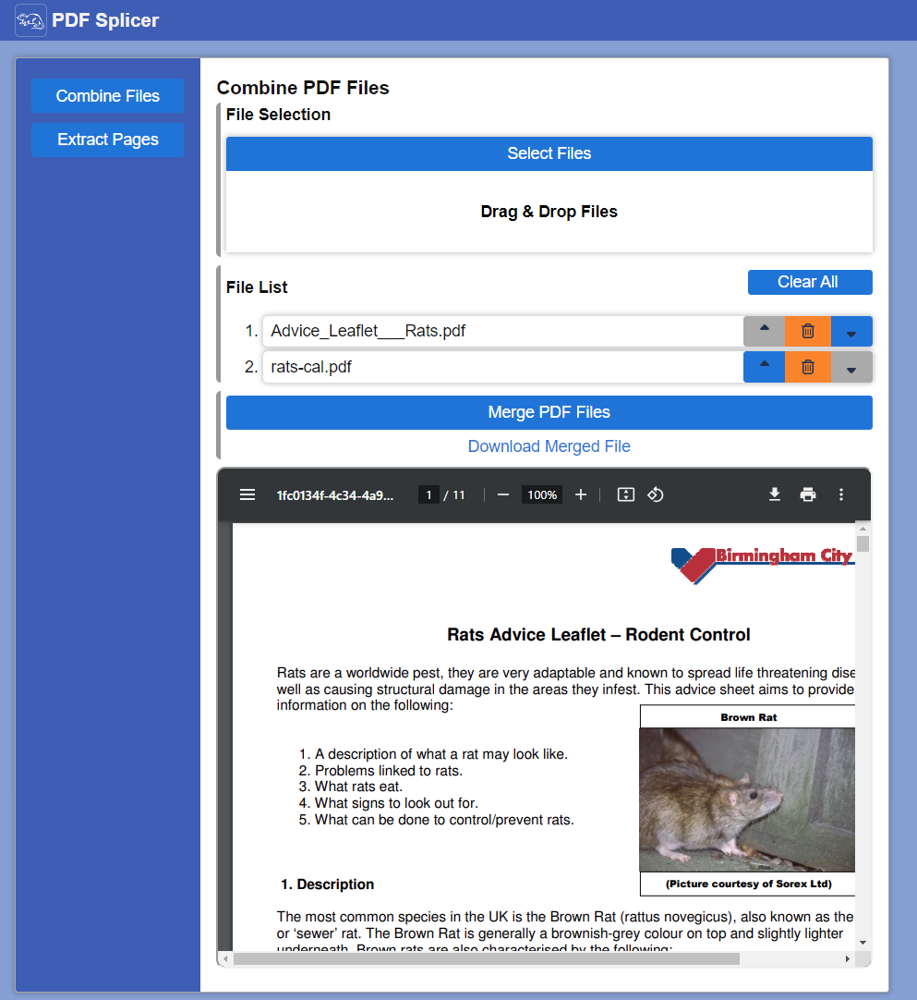
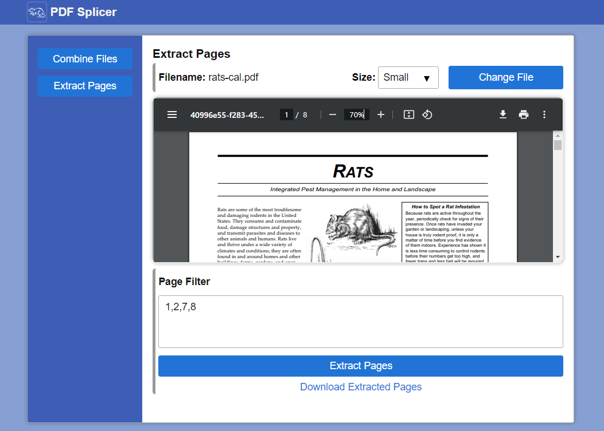

# PDF-Splicer

## About

A browser-based tool to merge multiple pdfs into a single file or extract pages from an existing pdf.

[Try it out here](https://eatmygoose.github.io/pdf-splicer/)

### Combine PDFs
Select any number of PDF files & combine them into a single PDF file.

The order of the PDFs can be edited via the up & down arrows within the ***File List*** menu.

### Extract Pages
Extract specific pages within a PDF file and save it as a new PDF file.

#### Page Filters
Specify individual pages using comma-separated page numbers (starting from 1) in the ***Page Filter*** section
- i.e. `1,2,3,5`

Page ranges can also be specified using dashes.
- i.e. `1-10, 15-20`

Page ranges & individual  pages may used together in a single filter
- i.e. `1,2,3,10-11`

## Credits

- Reference Image: https://www.publicdomainpictures.net/pictures/320000/nahled/rat-1580274550SsL.jpg

- Icons
   - Spinner: https://fontawesome.com/icons/rotate?f=classic&s=solid
   - Up/Down: https://fontawesome.com/icons/sort-up?f=classic&s=solid
   - Delete: https://fontawesome.com/icons/trash-can?f=classic&s=regular

